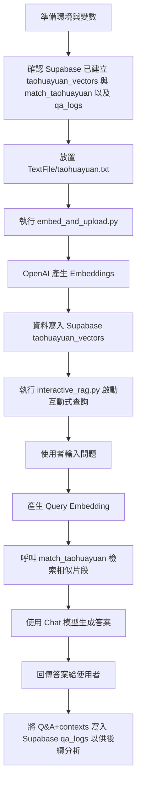

# 桃花源記 RAG Demo

此專案示範如何使用 Supabase + OpenAI 建立一個針對《桃花源記》的簡易 RAG（Retrieval-Augmented Generation）系統，包含：

- 向量資料準備與上傳 [`embed_and_upload.py`](embed_and_upload.py)
- 互動式問答查詢程式 [`interactive_rag.py`](interactive_rag.py)

---

## 專案結構

- [`embed_and_upload.py`](embed_and_upload.py)
  - 從 `.roo/taohuayuan.txt` 讀取《桃花源記》全文
  - 將文本依段落切分
  - 呼叫 OpenAI Embeddings API 產生向量
  - 透過 Supabase PostgREST API 將內容與向量寫入 `taohuayuan_vectors` 資料表

- [`interactive_rag.py`](interactive_rag.py)
  - 互動式 CLI 程式
  - 使用者輸入與《桃花源記》相關的問題
  - 產生問題向量並呼叫 Supabase 的 RPC：`match_taohuayuan`
  - 根據相似片段（Context）呼叫 OpenAI Chat 模型生成最終回答
  - 僅根據檢索到的片段作答，避免幻覺

- `.env`
  - 儲存 Supabase 與 OpenAI 的金鑰與設定（不應提交版本控制）

- `requirements.txt`
  - 專案所需 Python 套件

---

## 環境需求

- Python 3.9+
- 已建立的 Supabase 專案與：
  - 一個儲存文本與向量的資料表：`taohuayuan_vectors`
  - 一個 RPC / SQL function：`match_taohuayuan`（用於向量相似度搜尋）
- 可用的 OpenAI API Key（支援 embeddings 與 chat/completions）

---

## 安裝套件

請先安裝專案依賴：

```bash
pip install -r requirements.txt
```

`requirements.txt` 至少應包含（可依實際內容調整）：

- `openai`
- `python-dotenv`
- `requests`
```

---

## 環境變數設定 (.env)

請在專案根目錄建立 `.env` 檔案，包含以下變數：

```env
SUPABASE_URL=你的_supabase_project_url
SUPABASE_KEY=你的_supabase_anon_or_service_role_key
OPENAI_API_KEY=你的_openai_api_key

# 選填：指定 Chat 模型，預設為 gpt-4.1-mini
OPENAI_CHAT_MODEL=gpt-4.1-mini
```

說明：

- `SUPABASE_URL`：例如 `https://xxxx.supabase.co`
- `SUPABASE_KEY`：
  - 若使用匿名金鑰（anon key），請確認 RLS 與 Policies 允許相應操作
  - 若為服務金鑰（service_role key），請妥善保護，不要暴露到前端
- `OPENAI_API_KEY`：用於呼叫 OpenAI Embeddings 與 Chat 模型

---

## Supabase 資料表與 RPC 設定

### 1. `taohuayuan_vectors` 資料表結構 (建議)

請在 Supabase 建立資料表（可在 SQL Editor 中執行）：

```sql
create table if not exists taohuayuan_vectors (
  id bigserial primary key,
  content text,
  embedding vector(1536),
  source text
);
```

### 2. 建立向量相似度查詢函數 `match_taohuayuan`

此 RPC 用於從 `taohuayuan_vectors` 中取得與查詢向量最相似的片段：

```sql
create or replace function match_taohuayuan(
  query_embedding vector(1536),
  match_count int default 5,
  match_threshold float default 0
)
returns table (
  id bigint,
  content text,
  source text,
  similarity float
)
language plpgsql
as $$
begin
  return query
  select
    tv.id,
    tv.content,
    tv.source,
    1 - (tv.embedding <=> query_embedding) as similarity
  from taohuayuan_vectors as tv
  where 1 - (tv.embedding <=> query_embedding) >= match_threshold
  order by tv.embedding <=> query_embedding
  limit match_count;
end;
$$;
```

建立 RPC API 暴露（Supabase 預設會將此 function 以 `/rest/v1/rpc/match_taohuayuan` 形式提供）。

請根據專案安全需求設定適當的 RLS / Policies。

---

## 使用流程



### 步驟一：準備文本與向量資料

1. 確認 `.roo/taohuayuan.txt` 已存在，內容為《桃花源記》原文（或你希望索引的文本）。
2. 執行以下指令：

```bash
python embed_and_upload.py
```

此程式會：

- 讀取 `.roo/taohuayuan.txt`
- 依雙換行分段
- 呼叫 OpenAI Embeddings API 生成向量
- 呼叫 Supabase PostgREST API 將資料插入 `taohuayuan_vectors` 表

若成功，你將在終端機看到插入成功訊息與列數統計。

---

### 步驟二：啟動互動式 RAG 查詢

執行：

```bash
python interactive_rag.py
```

你將看到類似提示：

```text
--- 桃花源記 RAG 查詢系統 ---
使用模型: gpt-4.1-mini / 向量表: taohuayuan_vectors
輸入 'exit' 或 'quit' 結束程式。
------------------------------
```

接著可以輸入與《桃花源記》相關的問題，例如：

- 「桃花源中的人為什麼與外界隔絕？」
- 「漁人是如何找到桃花源的？」

程式流程：

1. 將問題轉換為向量（OpenAI Embeddings）
2. 呼叫 `/rest/v1/rpc/match_taohuayuan` 取得相似片段
3. 將片段組合為 context，呼叫 Chat 模型生成答案
4. 以繁體中文輸出結果，並避免捏造原文中不存在的敘述

輸入 `exit` 或 `quit` 可離開程式。

---

## 錯誤處理與注意事項

- 若缺少必要環境變數，兩個腳本都會在啟動時直接提示錯誤並結束。
- 若 `.roo/taohuayuan.txt` 不存在，[`embed_and_upload.py`](embed_and_upload.py) 會顯示錯誤訊息。
- 若 Supabase RPC `match_taohuayuan` 未正確建立或權限不足，[`interactive_rag.py`](interactive_rag.py) 會在查詢時印出錯誤細節。
- 若使用 anon key，請務必配置正確的 RLS 規則（或在開發階段暫時關閉），以允許：
  - `taohuayuan_vectors` 插入 / 查詢
  - `match_taohuayuan` 函數呼叫

---

## 總結

此專案提供一個最小可行的中文 RAG 範例，示範：

- 如何將文本切分並向量化後寫入 Supabase
- 如何透過 RPC 進行向量相似度檢索
- 如何使用 OpenAI Chat 模型在「只根據檢索內容回答」的前提下進行問答

可在此基礎上擴充為完整應用（如 API 服務、Web 介面、權限控制等）。